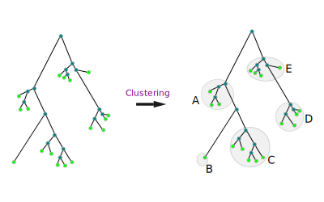
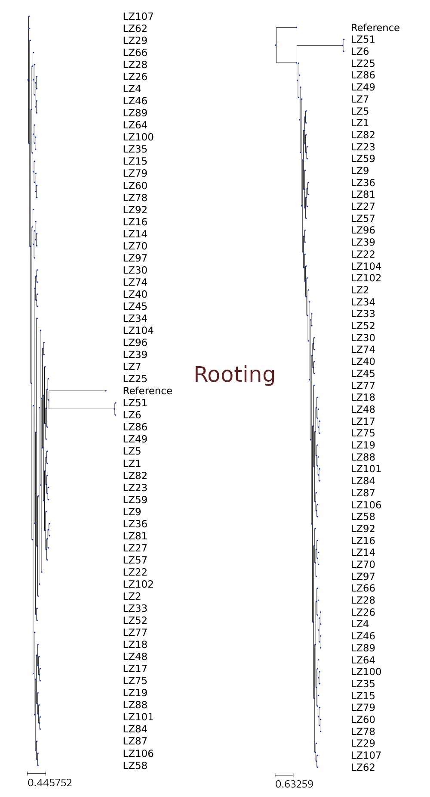
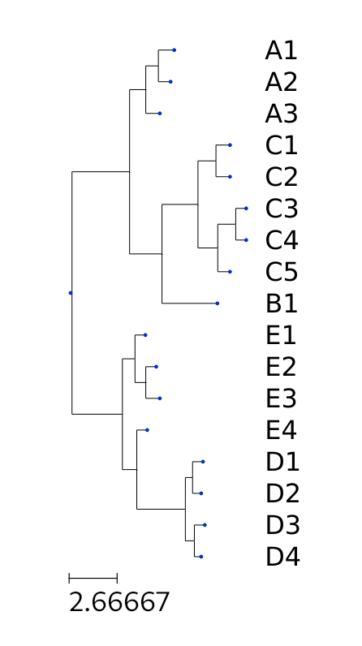
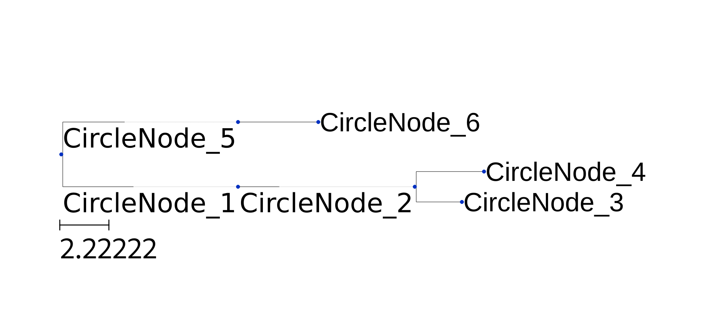
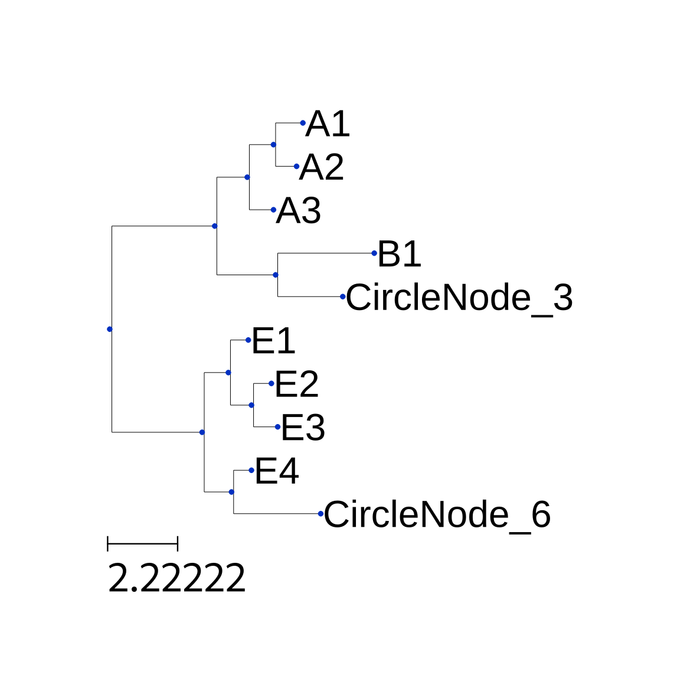

# Biotools
Biotools is an integrated toolset for bioinformatics.  

## table of contents  
* [Introduction](#Introduction)
* [Requirements](#Requirements)
* [Install](#Install)
* [Usage](#Usage)
* [Example](#Example)
## Introduction
Biotools is an integrated tool set for bioinformatics, it contain tools for formatting data, statistic bioinformatics data, handing phylogenetic tree et al. 

### 1. Phylogenic tree tools

* __Motivation__
  When we operat big phlogenic tree(for example a tree have thousands of leave node),
  analyse relationship of each node will be difficult if using GUI tools. And to drow this tree to a printable paper would be a problem too, may can print the tree using a A4 paper.
  So, I developed these tools to handle this problem.

1. phytree_setroot    
For a tree(stored by newick format), this tree may not set outgroup, and need to chose a node a outgruop node and root this tree. This tool is used doing this job, just give the tree file and name of outgroup node, the tool will output a tree file which have rooted.   

2. phytree_show   
This tool is used to show tree, and to have quick look of tree and save the figure in pdf format file.

3. phytree_statistic  
Show tree information, for example leaf which have longest branch, and average branch length of leaf. those information is usful when clustering or collapse tree.

4. phytree_cluster    
A as in above figure, the tree node would be clustered into groups, and print the clusting result into file. Then those cluser can be used for downstream analysis.

5. phytree_collapse    
Same as phytree_cluster tool, and collapse node within a cluster into a new node(We called it a circle node), and generage a profile tree, which represent the circle node tree.
 

## Requirements
* python3 >= 3.7  
* [biobrary](https://github.com/benjaminfang/biobrary)    

## Install
1. Install requirements.  
    `pip installl biobrary --user`

2. Install biotools  
`git clone https://github.com/benjaminfang/biotools`  
`cd biobrary`  
`./biobrary -h`  

    ___optional___:
    you can link biobrary to you PATH environment, in oreder to run this command without path prefix.  

## Usage
`biotools -h`  
```
Tools for bioinformatics.
The flowing tools/subcommand was supported:

    * format_fasta_head
    * format_table_separater
    * extra_table_raws
    * statistic_assembly
    * statistic_phytree
    * find_updown_elements
    * phytree_setroot
    * phytree_show
    * phytree_statistic
    * phytree_cluster
    * phytree_collapse

usage: biotools [-h] [-V] cmd_name [cmd_args [cmd_args ...]]

positional arguments:
  cmd_name       subcommand name.
  cmd_args       subcommand arguments.

optional arguments:
  -h, --help     show this help message and exit
  -V, --version  show program's version number and exit


```
 ### 1. Phylogenic tree tools

#### phytree_setroot
```
usage: phytree_setroot [-h] [-TF TREE_FORMAT] [-OG OUT_GROUP] [-o OUT_FILE]
                       nwkfile

set root of tree.

positional arguments:
  nwkfile               tree file name in newick format.

optional arguments:
  -h, --help            show this help message and exit
  -TF TREE_FORMAT, --tree_format TREE_FORMAT
                        newick tree format. default is 0.
  -OG OUT_GROUP, --out_group OUT_GROUP
                        name of outgroup.
  -o OUT_FILE, --out_file OUT_FILE
                        file name of output.

```

#### phytree_show
`biotools phytree_show -h`
```
usage: phytree_show [-h] [-TM {c,r}] [-SBL] [-SLN] [-SBP] [-SIN] [-AL] [-HI]
                    [-SP]
                    nwkfile

show phylogeneitc tree.

positional arguments:
  nwkfile               tree file name in newik format.

optional arguments:
  -h, --help            show this help message and exit
  -TM {c,r}, --tree_mode {c,r}
                        tree style mode.
  -SBL, --show_branch_length
                        show branch length
  -SLN, --show_leaf_name
                        show leaf name.
  -SBP, --show_branch_support
                        show branch support.
  -SIN, --show_inner_name
                        show inner node name.
  -AL, --align_leaf_name
                        align leaf name
  -HI, --hide_inner_node
                        hide inner node point.
  -SP, --save_plot      save plot directly.
  -o OUT_FILE, --out_file OUT_FILE
                      file name of saved pdf.


```


#### phytree_statistic  
`biobrary phytree_statistic -h`  
```
usage: phytree_statistic [-h] [-f_out F_OUT] tree_file

statistic phylogenetice tree.

positional arguments:
  tree_file     tree file name.

optional arguments:
  -h, --help    show this help message and exit
  -f_out F_OUT  out file name.

```

#### phytree_cluster  
`biotools phytree_cluster -h`
```
usage: phytree_groups [-h] [-f_cluster_res F_CLUSTER_RES]
                      [-f_profile_tree F_PROFILE_TREE]
                      treefile edge_len_cutoff

This is a utility to cluster a tree's node according to length of edge.

positional arguments:
  treefile              file name of newike tree.
  edge_len_cutoff       cutoff of edge length to make a circlal cluster.

optional arguments:
  -h, --help            show this help message and exit
  -f_cluster_res F_CLUSTER_RES
                        file name to output cluster result, default is
                        "cluster.fasta".
  -f_profile_tree F_PROFILE_TREE
                        CircleNode Tree profile tree file. default is
                        "profile.nwk".

```

#### phytree_collapse
`biotools phytree_collapse -h`
```
usage: phytree_collapse cluster [-h] [-cluster_result CLUSTER_RESULT]
                                [-collapse_tree COLLAPSE_TREE]
                                [-LK LEAF_NAME_KEEP | -LR LEAF_NAME_REMOVE | -MC MANUALLY_CHOOSE]
                                treefile edge_len_cutoff

positional arguments:
  treefile              phylogenetic tree file name in newike format.
  edge_len_cutoff       edge length to cluster.

optional arguments:
  -h, --help            show this help message and exit
  -cluster_result CLUSTER_RESULT
                        file name of cluster result. default is cluster.fasta
  -collapse_tree COLLAPSE_TREE
                        file name of collapse tree. default is
                        collapse_tree.nwk
  -LK LEAF_NAME_KEEP, --leaf_name_keep LEAF_NAME_KEEP
                        file list, leaf name that want keep, which can not
                        coexist with "leaf_name_remove".
  -LR LEAF_NAME_REMOVE, --leaf_name_remove LEAF_NAME_REMOVE
                        file list, leaf name that want remove, which can not
                        coexist with "leaf_name_keep".
  -MC MANUALLY_CHOOSE, --manually_choose MANUALLY_CHOOSE
                        file list, choose which leaf left maully.

```


## Examples

#### 1. Phylogenic tree tools 

1. phytree_setroot  

Using "Reference" as outgroup and rooted the tree, and save the result into tree_rooted.nwk. If no outgroup given, using tree midpoint as root.
`biotools phytree_setroot -o tree_rooted.nwk -OG Reference test/unrooted_tree.nwk`




2. phytree_show  

Show tree by retangle shap and show leave name and aligned the names and hide inner node.
`biotools phytree_show -TM r -SLN -HI -AL test/test_tree.nwk`



To save the plot using -SP argument and a file named "plot.pdf" will gerated.

3. phytree_statistic

Print statistical information of tree.  
`biotools phytree_statistic test/test_tree.nwk`  
```
max_edge_len: (Tree node 'C3' (0x7fb01c378cd), 9.6)
max_topology_len: (Tree node 'C3' (0x7fb01c378cd), 5.0)
shortest_leaf: [['D4', 0.3]]
longest_leaf: [['B1', 3.0]]
leaf_ave_len: 0.7058823529411765
```

4. phytree_cluster  

According a cutoff(you can decide this value baseon leaf_ave_len oupted by phytree_statistic), phytreee_cluster would generated two file. one is "__cluster.fasta__", and another is "__profile.nwk__", by default.
`./biotools phytree_cluster test/test_tree.nwk 1.5`   

```
cluster.fasta file,

>CircleNode_0
@:0;
>CircleNode_5
@((E1:0.5,(E2:0.5,E3:0.7)1:0.6)1:0.7,(E4:0.5)1:0.8);
E1
E2
E3
E4
>CircleNode_6
@((D1:0.5,D2:0.4)1:0.4,(D3:0.5,D4:0.3)1:0.5);
D1
D2
D3
D4
>CircleNode_1
@(((A1:0.8,A2:0.6)1:0.7,A3:0.7)1:0.9);
A1
A2
A3
>CircleNode_2
@:1.8;
>CircleNode_4
@B1:3;
B1
>CircleNode_3
@((C1:0.7,C2:0.7)1:1,((C3:0.5,C4:0.5)1:1,C5:0.6)1:1.1);
C1
C2
C3
C4
C5

```

cluseter.fasta:  
This file is used to record culster information. Every culster start by "__>__" and following cluster name,and "__@__" following subtree of this cluter, and other line is leaf name this cluster contained.

profile.nwk:  
This is a tree file, which profile how cluster node is look like.


5. phytree_collapse

`biotools phytree_collapse cluster test/test_tree.nwk 1.5`
This will generate two files by default: "__collapse_tree.nwk__" and "__cluster.fasta__".  
"__cluster.fasta__" is same as file generated by phytree_cluster.  
"__collapse_tree.nwk__" is a collapse tree removed leaves.

There are three will to chose whose leaves keeped in collapsed tree.
1) -LK, a leaf name list, which used to indicate cluster which contain leaf from this list will keep all leaves of this cluster.

For example, using following command,  
`biotools phytree_collapse cluster test/test_tree.nwk 1.5 -KL keep.list`
```
keep.list:
A1
E1
```

Would generate a collapsed tree list this:



2) -LR, A leaf list which will substract from all leaf, and then do works a -LK.

3) -MC, A leaf list, if a leaf within this list will be keeped, else, removed.(new added, not test untill now) 
